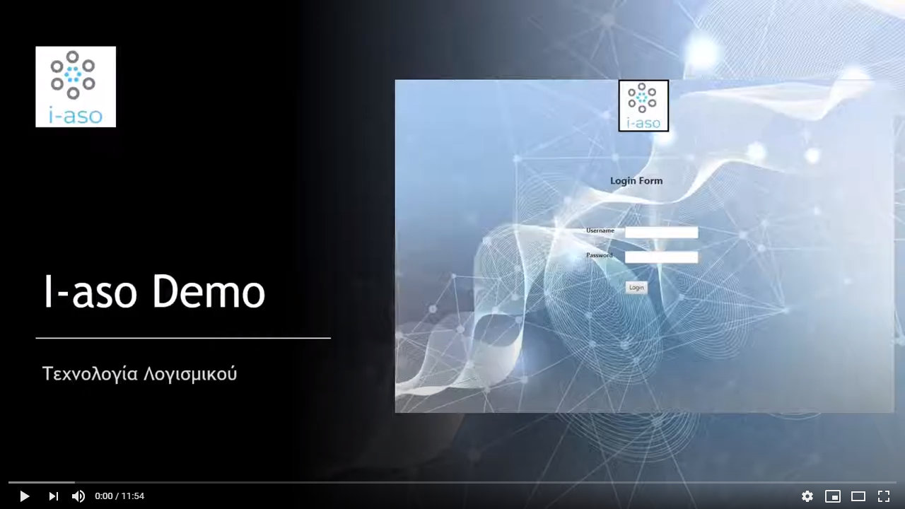

# i-aso
In Greece almost every hospital uses it's own software platform to register doctors, nurses, patients and other information. That causes various problems like lack of compatibility between different platforms and many communication problems. I-aso, willing to help these hospitals provides this platform to all of them.

## Name
This project named after a deity intertwined with the concept of healing Iaso *(Ιασώ)*.

## Contributors
* [Bakalis Nikolas](https://github.com/NikosBakalis): nbakalis@ceid.upatras.gr
* [Karatzas Andreas](https://github.com/andreasceid): ankaratzas@ceid.upatras.gr
* [Mayaki Anna](https://github.com/annamayaki): magiaki@ceid.upatras.gr
* [Tsakas Panagiotis](https://github.com/TsakasPanagiotis): tsakas@ceid.upatras.gr

## Execution
* With IntelliJ Idea:
```
1. Clone the project to the IDE.
    1. Copy the GitHub web page url: *https://github.com/NikosBakalis/i-aso*.
    2. Open IntelliJ IDEA click on: *Get from Version Control*.
    3. Paste the link into the URL area.
    4. Click clone.
2. Set your JRE version to 1.8 or above.
3. In *i-aso* folder expand *Java* and right click *Main.java*. Then clink on *Run 'Main.main()'*.
```
***
* With .jar file:
```
Future update.
```
***

## Dependencies
#### Database
```
1. You need to have a database server installed on your computer like MySQL Worckbench, XAMPP, etc.
2. Find our MySQL folder expand it and get iaso_prototype-v08.2.sql and iaso_prototype-v08.2-inserts.sql
3. Execute the MySQL code of these two files to your database server.
4. Your database is now ready.
```

#### Connection
```
1. Open up IntelliJ IDEA and load i-aso.
2. Use "Ctrl + Alt + Shift + S" to open Project Structure.
3. Click on "Libraries", add a "New Project Library" and click "Java".
4. On the new window find "Libraries\mysql-connector-java-8.0.19.jar" and click "Ok".
5. Your connection is now ready.
```

#### Connection Properties
```
1. Into the MySQL folder find connection.properties file and open it up.
2. Set your personal database connection info into the file.
3. Your connection properties are now ready.
```

#### Library Connection.
```
For this project we used one library which you can find in the "Libraries" folder.
```

## Demo Video
##### The video below explains how to use the i-aso application step-by-step.
The video language is Greek.
***
[](https://www.youtube.com/watch?v=GWVcuAEsNBs "Demo Video")
***

## File Management and MVC Model
1. Project code that is based on MVC model can be found into the "Java" folder. This folder contains three packages and to .java files:
    1. File with name Main.java is the main class of the program, and it generates the login screen so as the user can log in to the application.
    2. File with name TestTheMain.java created only for code testing, and it can be completely ignored by you.
    3. Package with name database is the Control of our MVC model, and it contains every communication with the database server.
    4. Package with name model is the Model of our MVC model, and it contains every table and every variable  of our database.
    5. Package with name ui is the View of our MVC model, and it contains all the user interfaces that our users can reach by navigating into the application.
2. Images folder contains all the images that our program and GitHub web-page uses.
3. Libraries folder contains the "mysql-connector-java-8.0.19.jar" library and assists us with the program-database connection.
4. MySQL folder contains 3 files:
    1. The connection.properties file that mast get the info of the user that wants to use the database.
    2. The iaso_prototype-v08.2.sql file that contains all the table creations of our database.
    3. The iaso_prototype-v08.2-inserts.sql file that contains some inserts for testing the program.
5. i-aso.iml file contains IntelliJ’s project specific settings files. like the xml version, the encoding, etc.
6. README.md is the GitHub file you are reading right now.
7. Finally, all the project specific files goes to ".idea" folder, and it will be recreated if you delete the project and "out" folder contains the output of your project when you build/compile it.
